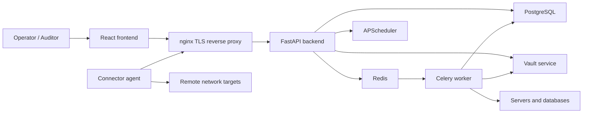
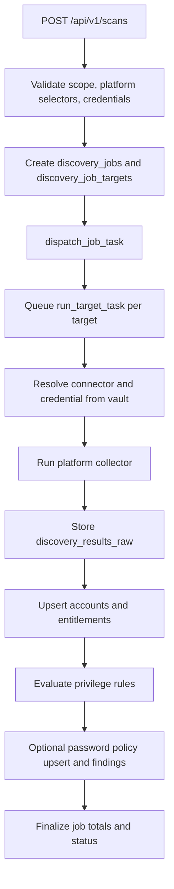
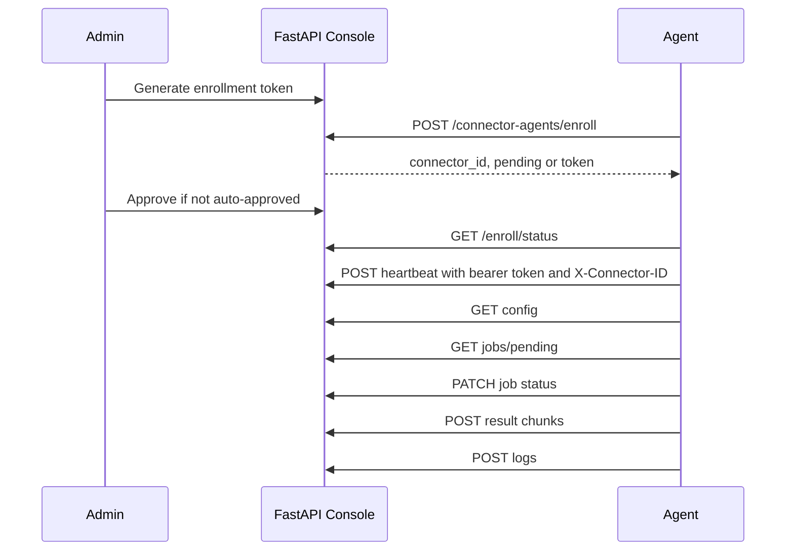
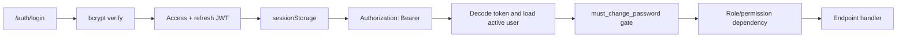
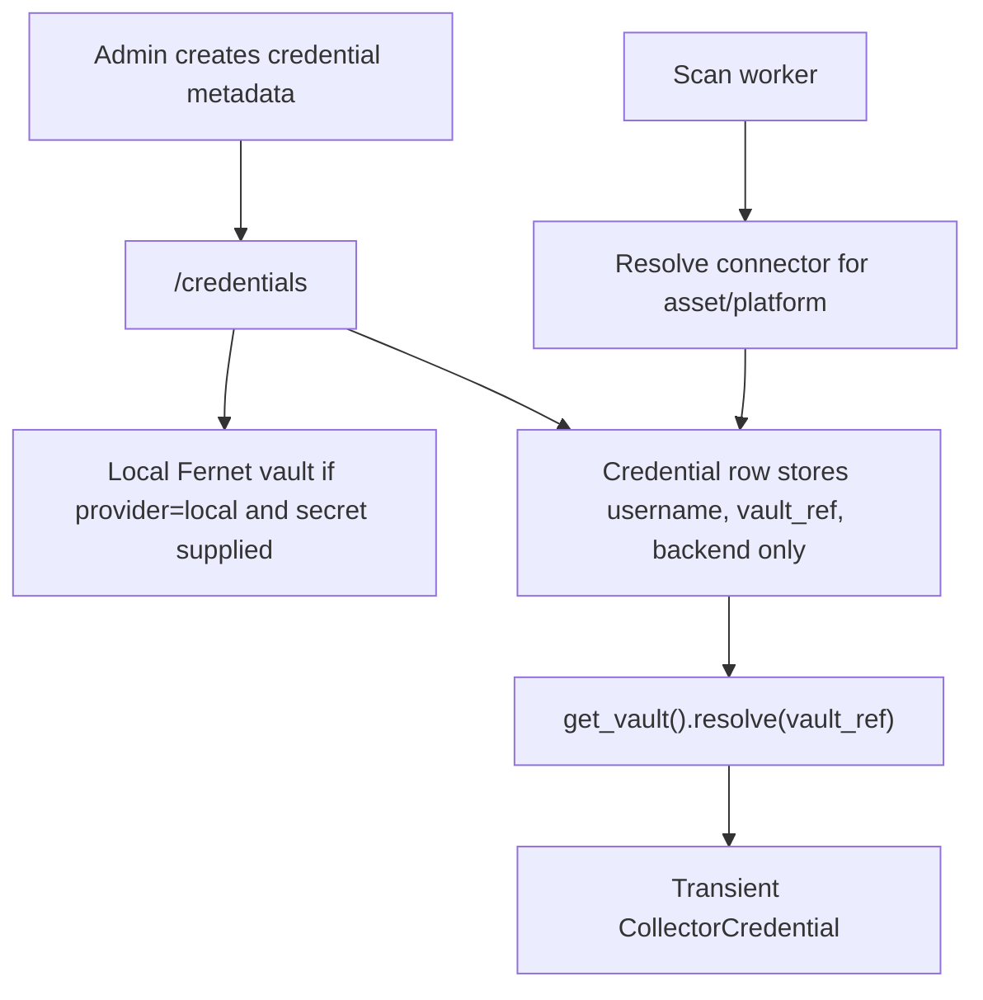

# Architecture

Version date: 2026-06-28

## Current Architecture

The active deployment in `docker-compose.yml` runs:

- `frontend`: Vite React development server.
- `nginx`: TLS termination and reverse proxy.
- `backend`: Python FastAPI app, `uvicorn app.main:app`.
- `worker`: Celery worker for scan tasks.
- `beat`: Celery beat process, although the FastAPI app also starts an APScheduler instance.
- `postgres`: PostgreSQL 16.
- `redis`: broker and result backend.

The repository also contains an inactive NestJS backend under `backend/src`. Current Docker files do not run it.

## System Context

## Frontend Architecture

- React 19, TypeScript, Vite, Redux Toolkit, RTK Query, React Router, Flowbite React, Tailwind CSS.
- `frontend/src/App.tsx` defines protected routes.
- `frontend/src/api/apiSlice.ts` is the main API client and refreshes access tokens on HTTP 401.
- `frontend/src/app/rbac.ts` gates navigation and controls in the UI only. The backend remains the enforcement boundary.
- Main pages include dashboard, assets, scans, accounts, findings, password policy, connectors/agents, tags, reports, audit, users, and settings.

## Backend Architecture

- `backend/app/main.py` wires FastAPI routers under `/api/v1`.
- `backend/app/security.py` handles bcrypt password hashing, JWT access/refresh tokens, current-principal lookup, roles, and permission helpers.
- SQLAlchemy models live under `backend/app/models`.
- Pydantic schemas live under `backend/app/schemas`.
- API routers live under `backend/app/api/v1`.
- Scan orchestration lives in `backend/app/services/scan_service.py`.
- Celery tasks live in `backend/app/workers/tasks.py`.
- Collector modules live in `backend/app/collectors`.
- Rule engines live in `backend/app/rules_engine` and `backend/app/services/password_policy_rules.py`.

## Database Architecture

The database stores users/roles, assets/groups/tags, connectors/credentials, discovery jobs/targets/profiles/schedules, raw probe results, normalized accounts, entitlements, privilege findings, password policies/findings/exceptions, connector agents/jobs/results/logs, audit logs, notifications, and rules.

Alembic migrations are present through `0013_user_management_metadata.py`.

## Scan Workflow

## Connector-Agent Communication

Implemented today: token enrollment, heartbeat, config pull, job polling, status update, chunk upload, log upload, and ingestion of uploaded accounts. Planned or partial: mTLS, packaged installers, durable offline result queue, and non-Windows agent scanners.

## Authentication and RBAC Flow

Roles and permissions are enforced in the backend. Some endpoints use role dependencies rather than the newer permission dependency, so the documented matrix should be treated as the authority for current behavior.

## Credential Handling Flow

Secrets are not returned by credential APIs. The local provider writes encrypted secrets to `/app/vault_data/local_vault.json`. External providers are stubs.

## Audit Logging Flow

Sensitive actions call `log_action`, which writes `audit_logs` with actor, action, subject, IP, user agent, context, and timestamp. Audit reads are available to `admin` and `auditor`. The log is append-only by application convention, not by database immutability controls.

## Export Flow

Exports query normalized tables and stream CSV or Excel responses. Account exports are in `backend/app/api/v1/exports.py`; password-policy exports are in `backend/app/api/v1/password_policy.py`. Export actions are audit logged.

## Trust Boundaries

- Browser to nginx/API: authenticated HTTPS boundary.
- API to database/Redis/vault: internal service boundary.
- Worker to targets: credentialed read-only discovery boundary.
- Connector agent to console: outbound HTTPS with bearer token and connector ID.
- Target evidence to UI: untrusted evidence is parsed/stored and should be rendered as data, not HTML.

## Security-Sensitive Components

- JWT signing key and token TTL settings.
- Local vault Fernet key or external vault integration.
- Credential APIs and connector assignment.
- Scan launch and worker credential resolution.
- Connector-agent enrollment tokens and bearer tokens.
- Audit log and export endpoints.
- `COLLECTOR_MODE`, `DEMO_MODE`, and production startup validation.
